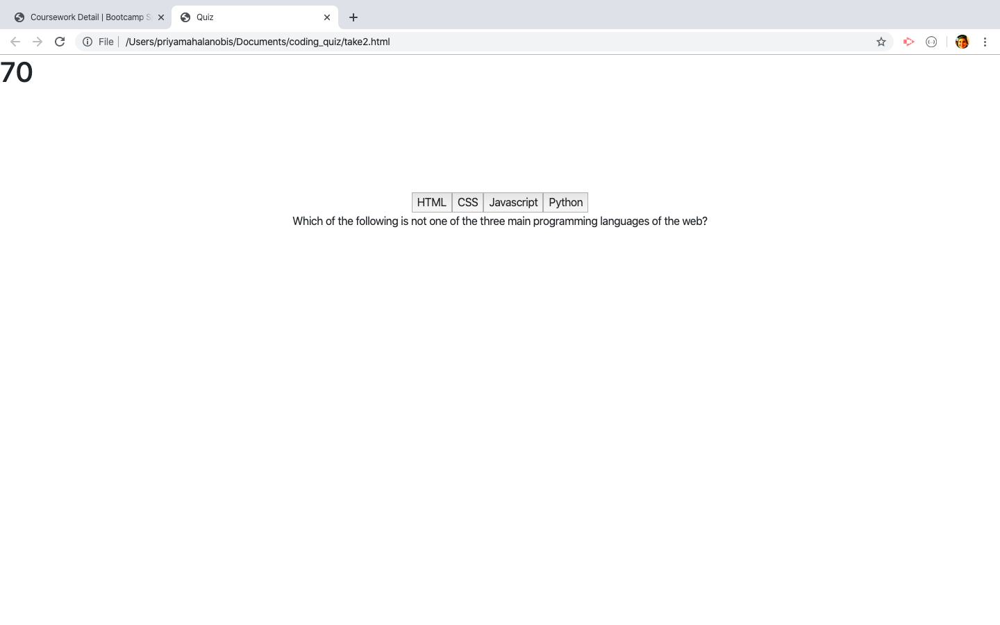
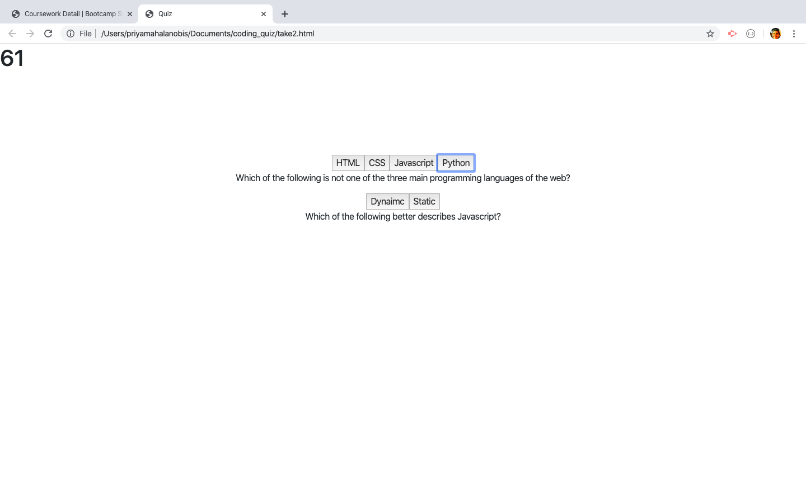

# My Quiz Application

My coding quiz website was built as an exercise to gain practice coding various aspects of "vanilla" Javascript, such as functions, arrays and for-loops.

The concept of the user's interaction with the site is that they are taking a quiz, and in doing so, attempting to answer as many of the five questions as they can with both accuracy and speed. When the user begins taking the quiz, a timer near the top of the page begins counting down from "75" until it reaches zero. The higher this number is by the time the user is finished taking the quiz, the better their score is; however, each selection of an incorrect answer results in a subtraction of 15 additional points.

While I was able to use Javascript to code many features, there are several aspects I had difficulty completing. These include: getting the previous questions to be hidden once the user has selected answers to them, and using the DOM method to target the button (choice) elements as well as the question-sentence elements to make the choices appear beneath the question rather than vice-versa. Hopefully I will be able to improve these aspects with additional time and work.

### GH Pages URL:  https://pmahalan.github.io/coding_quiz/

